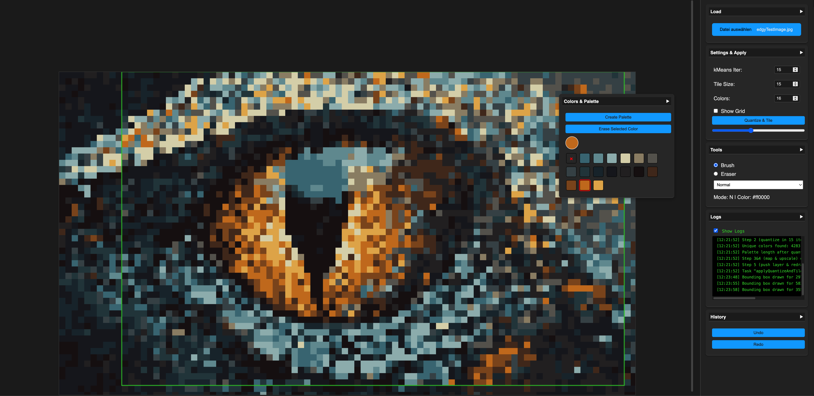

# Pixel-Art Quantization Approach

This project uses **K-Means clustering** for color quantization, optimized specifically for pixel-art style images. The goal is **accurate color representation** while allowing optional pixelation via tile size.
Since K-Means initializes with arbitrary centroids, each quantization may produce slightly different results.

---

Test it out:

## Design Decisions

1. **K-Means Choice**
   - Deliberately using K-Means to preserve **true color fidelity**.
   - Other algorithms may be faster but often compromise on the **exactness of colors**, which is essential for pixel-art style accuracy.
   The default number of iterations is 1. This can be increased for better results on large-tile pixelations.

2. **Tile-Based Downscaling**
   - For larger tile sizes, the image is **internally downscaled** before running K-Means.
   - Each tile is assigned the nearest quantized color from the downscaled image.
   - **Purpose:** Reduces computation while maintaining the visual structure of large tiles.
   - **Important:** Downscaling is **not applied** for full-resolution 1:1 requests to avoid any loss in color accuracy.

3. **Single-Pass K-Means**
   - For 1:1 full-resolution processing, only **one iteration** of K-Means is sufficient due to the reduced number of effective clusters per pixel.
   - Ensures that **user-requested resolution and color fidelity** are fully respected.

4. **Performance Considerations**
   - Using **Web Workers** to run K-Means off the main thread, preventing UI blocking.
   - Tile-based downscaling provides a **speed optimization** without affecting the full-resolution output.
   - While the system can handle larger or more complex images, it is primarily optimized for pixel-art quality.

---

## Summary

- **Pixel-art focused:** Prioritizes color accuracy over raw speed.
- **Full-res 1:1 requests:** No downscaling; exact color representation.
- **Large tile pixelation:** Downscaling applied per tile to reduce computation.
- **K-Means algorithm:** Chosen deliberately; alternative methods may lose fidelity.
- **Web Worker integration:** Ensures quantization runs asynchronously, keeping UI responsive.
- **Versatile:** While optimized for pixel-art, it **can handle other images**, though the primary goal is pixel-accurate quantization.

> ⚠️ **Tip:** This is not a general graphics app; the workflow is optimized for **pixel-art and pixel-accurate quantization**, not for photo editing or smooth gradients—even if it can technically process them.

### Influence of tile (block) size on performance
| tileSize | Pixels per tile | Relative pixels to full res | Observed speed effect       |
| -------- | --------------- | --------------------------- | --------------------------- |
| 1        | 1×1 = 1         | 100 %                       | Slowest (full k-means load) |
| 2        | 2×2 = 4         | 25 %                        | \~4× faster than tileSize 1 |
| 3        | 3×3 = 9         | \~11 %                      | \~9× faster than tileSize 1 |
| 4        | 4×4 = 16        | 6.25 %                      | \~16× faster                |
| 5        | 5×5 = 25        | 4 %                         | \~25× faster                |
| 10       | 10×10 = 100     | 1 %                         | \~100× faster               |
